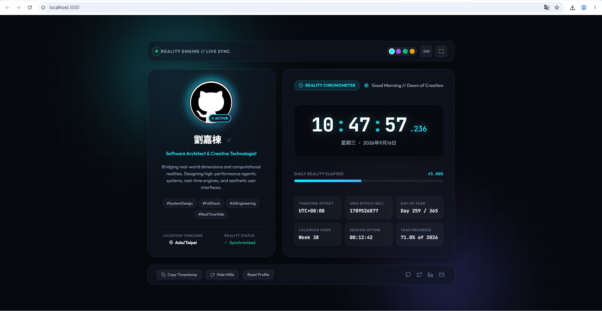

# 0916 // Personal Profile & Reality Time Engine
> **AIoT-DA (智慧物聯網與數據分析) · 課堂實作專案 1**

[](https://arthurliu424.github.io/0916/)
[](https://arthurliu424.github.io/0916/)
[](https://github.com/ArthurLiu424/0916)

---

## 🌐 線上展示與快速連結 (Live Website & Deployment)

- 🔗 **正式上線網址 (Live Website)**：[https://arthurliu424.github.io/0916/](https://arthurliu424.github.io/0916/)
- 📦 **GitHub 原始碼倉庫**：[https://github.com/ArthurLiu424/0916](https://github.com/ArthurLiu424/0916)
- 🚀 **部署狀態**：已成功透過 GitHub Pages 自動部署上線，可直接於瀏覽器體驗完整互動功能。

---

## 📸 介面成果預覽 (Layout Preview)



---

## 📋 課堂基本需求對照表 (Requirements Checklist)

| 項次 | 規定項目 | 規範細節 | 實作狀態 | 專案實作亮點 |
| :--- | :--- | :--- | :---: | :--- |
| 👤 **1** | **Profile** | 姓名、個人照片/Avatar、科系/專長、簡短自我介紹 | ✅ 100% 達成 | 劉嘉棟 (Arthur Liu)、`avatar.jpg`、AIoT / 智慧物聯網、完整自介，支援前端在線點擊編輯並儲存於 `localStorage` |
| 🛠 **2** | **Skills** | 至少列出 3 項技能 | ✅ 100% 達成 | 超標列出 6 大項：Python, C/C++, Machine Learning & AI, IoT, Web, Data Analysis，含熟練度進度條 |
| 🚀 **3** | **Projects** | 至少介紹 1 個作品 (名稱、描述、使用技術、GitHub Link) | ✅ 100% 達成 | 完整展示 2 個代表作品：Reality Chronometer Hub 及 AIoT Sensor Telemetry Monitor |
| 🕐 **4** | **Live Clock** | JavaScript 即時時鐘 (HH : MM : SS、自動更新) | ✅ 100% 達成 | 原生 JS 高頻即時更新時鐘，支援毫秒顯示切換、12/24H 切換、日光進度條與時段動態問候 |
| 🎨 **5** | **Personal Design** | 個人化風格、顏色、字型、背景、Layout、Cards、動畫 | ✅ 100% 達成 | Cyberpunk 玻璃擬態、4 組自訂主題切換引擎、Google Fonts、流光背景球與微動畫 |
| 🌐 **+** | **Live Website** | 附上 Demo 網址與功能說明 | ✅ 100% 達成 | 完整上線於 [https://arthurliu424.github.io/0916/](https://arthurliu424.github.io/0916/) |

---

## 📌 五大核心功能詳細介紹

### 👤 1. 個人簡介 (Profile)
- **姓名**：劉嘉棟 (Arthur Liu)
- **個人頭像 (Avatar)**：採用專屬頭像（`avatar.jpg`），外圈具備動態發光呼吸光暈（Pulsing Halo）與 Active 綠色在線脈衝訊號燈。
- **科系與領域**：AIoT & 智慧物聯網 / 數據分析 (Data Analysis) / 軟體工程。
- **簡短自傳**：專注於 AIoT 物聯網架構、數據分析與機器學習應用。熱愛探索邊緣端運算、即時感測串流與現代化 Web 交互設計，致力於打造融合軟硬體的智慧創新系統。
- **即時編輯與保存**：姓名、頭銜、自我介紹皆設有 `contenteditable` 屬性，點擊即可直接於網頁上修改，失焦時自動同步存入瀏覽器 `localStorage`，重新整理也不會遺失。

---

### 🛠 2. 專業技能矩陣 (Skills)
完整收錄 6 大核心領域技術卡片，每張卡片皆包含圖標、熟練度百分比進度條與技術標籤：
1. **Python** (`Advanced 92%`)：時序數據清洗 (Pandas, NumPy)、自動化串流處理與機器學習模型開發 (PyTorch / Scikit-Learn)。
2. **C / C++** (`Proficient 88%`)：微控制器韌體設計 (ESP32 / Arduino)、感測器通訊 (I2C/SPI)、底層記憶體優化與即時運算。
3. **Machine Learning & AI** (`Proficient 85%`)：特徵工程、分類與回歸預測模型建構、邊緣端推論整合以及異常狀態智能檢測。
4. **IoT & Smart Systems** (`Advanced 90%`)：物聯網節點佈建、MQTT 通訊協議、環境感測器串流與遠端設備遙測監控。
5. **Web Development** (`Proficient 88%`)：語意化 HTML5、現代 CSS 玻璃擬態視覺設計、原生 JavaScript (ES6+) 與動態響應介面。
6. **Data Analysis** (`Proficient 89%`)：時序感測數據探索、異常過濾、統計特徵擷取與視覺化圖表呈現。

---

### 🚀 3. 專案作品展示 (Projects)

#### 專案一：Reality Time & Personal Profile Hub (即時時鐘與個人儀表板)
- **專案簡介**：結合 Cyberpunk 玻璃擬態美學與毫秒級高精度 JavaScript 即時時鐘引擎的個人專屬儀表板。支援 12/24H 時制切換、動態日光流逝進度條、4 種自訂主題色彩調配、在線即時編輯儲存與完整響應式動畫。
- **核心技術**：`HTML5`、`CSS3 Glassmorphism`、`JavaScript (ES6+)`、`GitHub Pages`、`Git`
- **專案連結**：[線上演示 (Live Demo)](https://arthurliu424.github.io/0916/) ｜ [GitHub 原始碼](https://github.com/ArthurLiu424/0916)

#### 專案二：AIoT Real-Time Sensor Telemetry Monitor (智慧感測串流監控平台)
- **專案簡介**：智慧感測物聯網節點與邊緣串流分析系統。透過 ESP32 與溫濕度/環境感測模組進行邊緣數據採樣，利用 MQTT 協議即時傳輸至後端伺服器進行數據清洗與異常統計分析，並結合前端動態儀表板呈現連續時序圖表。
- **核心技術**：`Python`、`C++ / ESP32`、`MQTT Protocol`、`WebSockets`、`Data Visualization`
- **專案連結**：[GitHub 專案庫](https://github.com/ArthurLiu424/0916)

---

### 🕐 4. JavaScript 即時時鐘引擎 (Live Clock)
- **即時流暢跳動**：利用 `requestAnimationFrame` 與系統時鐘深度綁定，時間每分每秒平滑即時更新。
- **時分秒清晰呈現**：清晰呈現 `HH : MM : SS`，具備閃爍冒號分隔符。
- **進階計時與時空度量**：
  - **毫秒顯示切換**：可一鍵顯示或隱藏微秒級 `.mmm` 數字。
  - **12H / 24H 時制**：可一鍵即時切換 24 小時制與 12 小時制（附帶 AM/PM 標籤）。
  - **動態環境時段問候**：根據系統時間自動切換問候語（清晨、午後、黃昏、深夜）與對應天氣圖示。
  - **日光進度流 (Daily Reality Elapsed)**：即時計算當日已過時間的百分比與流動光條。
  - **時空度量數據**：包含時區偏移量 (UTC+08:00)、Unix Epoch 時間戳、Day of Year、年進度百分比以及連線會話時長 (Session Uptime)。
  - **一鍵複製時間戳**：點擊按鈕即可將目前時間與 ISO 格式時間複製至剪貼簿。

---

### 🎨 5. 個人專屬美學與設計風格 (Personal Design)
本站全面採用客製化設計，體現科技未來感：
- **動態主題調色盤 (Theme Engine)**：
  - 💎 **Cyan Theme**（賽博霓虹青 - 預設）
  - 🔮 **Violet Theme**（星雲紫）
  - 🌿 **Emerald Theme**（生機翡翠綠）
  - ⚡ **Amber Theme**（耀光琥珀金）
  - 點擊右上角調色點即可全站即時套用不同光暈與邊框色彩。
- **現代字體排印 (Modern Typography)**：
  - 標題與內文引進 Google Fonts **Outfit**。
  - 數字與時間碼採用 **JetBrains Mono** 等寬字體，確保數字跳動時排版不抖動。
- **動態流光背景 (Ambient Dynamics)**：
  - 內建 3 組浮動發光球體（Floating Orbs），並具備滑鼠游標微幅互動視差效果。
  - 鋪設 40px 精細高科技半透明格線。
- **極致玻璃擬態 (Glassmorphism & Responsive Layout)**：
  - 採用 `backdrop-filter: blur(20px)` 半透明磨砂卡片，搭配柔和立體陰影與發光邊框。
  - 完整支援桌上型電腦、筆記型電腦、平板以及直式智慧型手機之自適應排版。

---

## 💻 本地啟動指南 (Local Development)

若要在本機端運行測試：

```bash
# 1. 複製專案庫
git clone https://github.com/ArthurLiu424/0916.git

# 2. 進入專案目錄
cd 0916

# 3. 使用 Python 啟動本機伺服器
python -m http.server 3000

# 4. 在瀏覽器打開
# http://localhost:3000
```

---

## 👨‍💻 作者與聯絡資訊 (Author & Contact)

- **開發者**：劉嘉棟 (Arthur Liu)
- **GitHub 主頁**：[@ArthurLiu424](https://github.com/ArthurLiu424)
- **線上專案網址**：[https://arthurliu424.github.io/0916/](https://arthurliu424.github.io/0916/)
- **專案原始碼**：[ArthurLiu424/0916](https://github.com/ArthurLiu424/0916)